# VeloxML ⚡

> **Push to API in one command.**  
> The open-source LLM & SLM deployment engine that provisions optimized infrastructure directly in your AWS/GCP account.

---

## ⚡ Quick Start Tutorial: Deploying a Small Language Model (SLM) on AWS

This hands-on tutorial guides you through deploying a real Small Language Model ([`HuggingFaceTB/SmolLM2-135M-Instruct`](https://huggingface.co/HuggingFaceTB/SmolLM2-135M-Instruct)) on AWS EC2 using VeloxML.

---

### 📋 Prerequisites

1. **Python 3.10+** installed.
2. **AWS CLI** configured on your machine (`aws configure` with valid credentials).
3. Verify cloud access with VeloxML:
   ```bash
   veloxml check
   ```

---

### 🛠️ Step 1: Install VeloxML

Install VeloxML in your virtual environment:

```bash
pip install veloxml-deploy
```

Or install in editable mode for local development:
```bash
git clone https://github.com/veloxml/veloxml-deploy.git
cd veloxml-deploy
pip install -e .
```

---

### 📦 Step 2: Create your SLM Service

Create a new directory for your service:

```bash
mkdir -p smollm-slm-service
cd smollm-slm-service
```

#### 1. Define the Inference Server (`app.py`)

Create `app.py` to serve SmolLM2 using FastAPI and Hugging Face Transformers:

```python
import os
import torch
from fastapi import FastAPI
from pydantic import BaseModel
from transformers import pipeline

app = FastAPI(title="SmolLM2 SLM Service")

MODEL_ID = os.getenv("MODEL_ID", "HuggingFaceTB/SmolLM2-135M-Instruct")
pipe = None

@app.on_event("startup")
def load_model():
    global pipe
    print(f"Loading SLM: {MODEL_ID}...")
    pipe = pipeline(
        "text-generation",
        model=MODEL_ID,
        device_map="auto" if torch.cuda.is_available() else "cpu",
        torch_dtype=torch.float32,
    )
    print("Model loaded successfully!")

class GenerateRequest(BaseModel):
    prompt: str
    max_tokens: int = 50

@app.get("/health")
def health():
    return {"status": "ok", "model": MODEL_ID, "ready": pipe is not None}

@app.post("/predict")
def predict(req: GenerateRequest):
    if pipe is None:
        return {"error": "Model not ready"}
    
    messages = [{"role": "user", "content": req.prompt}]
    outputs = pipe(messages, max_new_tokens=req.max_tokens, do_sample=True, temperature=0.7)
    
    generated_text = outputs[0]["generated_text"][-1]["content"]
    return {
        "model": MODEL_ID,
        "prompt": req.prompt,
        "response": generated_text
    }
```

#### 2. Define the VeloxML Spec (`veloxml.yaml`)

Create `veloxml.yaml` to specify instance requirements and spot provisioning:

```yaml
service:
  name: velox-smollm
  version: 1.0.0
  entrypoint: uvicorn app:app --host 0.0.0.0 --port 8000
  port: 8000
  health_endpoint: /health

compute:
  cloud: aws
  region: us-east-1
  cpus: 4
  memory: 8GB
  use_spot: true

scaling:
  min_replicas: 1
  max_replicas: 1
  target_qps: 10
```

---

### 🚀 Step 3: Deploy with VeloxML

Run the single deployment command:

```bash
veloxml deploy
```

VeloxML will:
1. Validate your cloud credentials and quota.
2. Select the optimal AWS Spot instance (`c6i.xlarge` in `us-east-1`).
3. Provision the replica node, set up the PyTorch runtime, and load the weights.
4. Verify HTTP 200 readiness and return your live endpoint.

---

### 🧪 Step 4: Test Real-Time Inference

Once the deployment completes, test the live endpoint:

```bash
curl -X POST http://<YOUR_REPLICA_IP>:8000/predict \
  -H "Content-Type: application/json" \
  -d '{"prompt": "What is the capital of Portugal?", "max_tokens": 40}'
```

#### Example Output:
```json
{
  "model": "HuggingFaceTB/SmolLM2-135M-Instruct",
  "prompt": "What is the capital of Portugal?",
  "response": "The capital of Portugal is Lisbon, located in the southern region of Portugal."
}
```

---

### 📊 Deployment Stats & FAQ

#### ⏱️ How long did this deployment take?

From running `veloxml deploy` to receiving the working `curl` command took **~2 minutes (cold start)**:

```mermaid
gantt
    title ⏱️ Cold Start Deployment Timeline (~2m Total)
    dateFormat X
    axisFormat %s sec
    section 1. AWS Spot VM
    Provisioning c6i.xlarge (50s)       :active, a1, 0, 50
    section 2. Environment
    PyTorch & Dependencies (40s)        :crit, a2, 50, 90
    section 3. Model Weights
    Download SmolLM2 ~270MB (20s)       :a3, 90, 110
    section 4. Service Live
    FastAPI Boot & Probe (15s)          :done, a4, 110, 125
```



> ⚡ **Subsequent / Warm code updates take under 15 seconds.**

#### 🎯 Was it truly just one command?
**Yes.** You do not need to:
- ❌ Write Dockerfiles or build multi-GB container images.
- ❌ Configure Kubernetes manifests, Helm charts, or ingress controllers.
- ❌ Set up AWS Security Groups, VPC routes, or IAM policies manually.
- ❌ Manage SSH keys or reverse proxies.

VeloxML compiles your `veloxml.yaml` + `app.py` directly into an active, self-healing cloud endpoint.

#### 💰 How much does this cost?
Running `SmolLM2-135M-Instruct` on an AWS `c6i.xlarge` Spot instance costs approximately **$0.06 / hour** (~$1.44/day if kept running continuously), compared to $0.25+/hr for on-demand equivalents or expensive managed ML platforms.

---

### 🧹 Step 5: Zero-Cost Teardown

To stop incurring cloud costs when testing is done:

```bash
veloxml down --all
```

Check active services anytime:
```bash
veloxml status
```

---

## 📄 License
Apache-2.0 License.
