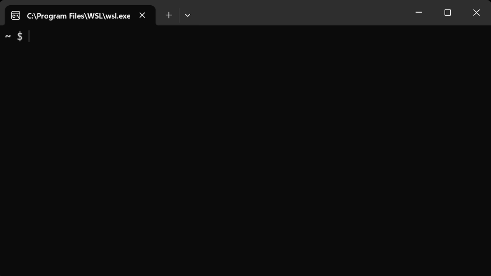

# VeloxML

Deploy open-source LLMs directly to your own AWS/GCP account with one command. Zero Docker, zero Kubernetes, scale-to-zero.

<p align="center">
  
</p>

**Contents**
- [Status](#status)
- [Example](#example)
- [Introduction](#introduction)
    - [What is this?](#what-is-this)
    - [Cool, but why not just use Modal, RunPod, or Baseten?](#cool-but-why-not-just-use-modal-runpod-or-baseten)
    - [What are the benefits?](#what-are-the-benefits)
    - [What can I build with this?](#what-can-i-build-with-this)
- [Getting started](#getting-started)
- [Contributing](#contributing)
- [License](#license)
- [Credits](#credits)

## Status

- [x] Alpha: Under heavy development
- [ ] Beta: Ready for use. But go easy on us, there may be a few kinks.
- [ ] 1.0: Use in production!

This repo is still under heavy development and the documentation is evolving. You're welcome to try it, but expect some breaking changes. Watch "releases" of this repo to receive a notification when we are ready for Beta. And give us a star if you like it!

## Example

```bash
# 1. Initialize a model service
veloxml init my-model
cd my-model

# 2. Deploy to AWS with scale-to-zero
veloxml deploy

# Output:
# Replica ready at http://34.201.45.12:8000
# Test your endpoint:
# curl -X POST http://34.201.45.12:8000/predict \
#   -H "Content-Type: application/json" \
#   -d '{"prompt": "Hello world"}'
```

## Introduction

#### What is this?

This is a CLI and deployment engine that allows you to deploy open-source LLMs directly to your own cloud account (AWS/GCP) with a single command.

It works like this:

1. the CLI reads your model code (`app.py`) and hardware spec (`veloxml.yaml`)
2. it provisions an optimized Spot or On-Demand instance (via SkyPilot) directly inside your cloud account
3. it prepares the runtime, loads the weights, verifies the health probe, and prints a ready-to-test `curl` command.

#### Cool, but why not just use Modal, RunPod, or Baseten?

A few reasons:

1. Your data, prompts, and model weights never leave your own AWS/GCP account. Zero third-party servers, and zero SOC2 or HIPAA compliance headaches
2. You don't have to pay a $50k-$100k enterprise paywall just to deploy inside your private VPC. VeloxML gives you that exact serverless experience natively in your account on day one
3. Zero framework lock-in. Modal forces you to rewrite your code with proprietary decorators (`@modal.function`)

#### What are the benefits?

1. The beauty of deploying directly to your own cloud account is that your proprietary data, customer queries, and model weights never leave your security perimeter. Zero third-party compliance reviews (SOC2/HIPAA) needed.
2. Cost efficiency. VeloxML defaults to Spot instances (`use_spot: true`), allowing you to serve models on AWS without burning $1,500+/mo on idle, unmanaged GPUs.
3. This is built on SkyPilot, an [extremely robust open-source compute orchestrator](https://github.com/skypilot-org/skypilot) developed at UC Berkeley.

#### What can I build with this?

1. Private LLM inference APIs (any open-weights checkpoint or fine-tuned model)
2. Custom embedding & reranking microservices
3. Real-time reasoning and agent tool-calling backends
4. Domain-specific fine-tuned models hosted securely inside your VPC
5. High-throughput batch inference endpoints

## Getting started

Deploy a real, open-weights Small Language Model ([Qwen/Qwen2.5-0.5B-Instruct](https://huggingface.co/Qwen/Qwen2.5-0.5B-Instruct)) directly to your AWS account on a Spot instance (~$0.07/hr) in under 2 minutes.

1. Install and verify cloud access

```bash
pip install veloxml-deploy
veloxml check
```

2. Create project folder

```bash
mkdir llm-service
cd llm-service
```

3. Create `app.py`

Paste this into `app.py`:

```python
from fastapi import FastAPI
from transformers import pipeline

app = FastAPI()
pipe = pipeline("text-generation", model="Qwen/Qwen2.5-0.5B-Instruct")

@app.get("/health")
def health():
    return {"status": "ok"}

@app.post("/predict")
def predict(data: dict):
    return {"response": pipe([{"role": "user", "content": data["prompt"]}], max_new_tokens=50)[0]["generated_text"][-1]["content"]}
```

4. Create `veloxml.yaml`

Paste this into `veloxml.yaml`:

```yaml
name: llm-service
compute:
  cpus: 4+
  memory: 8+
  use_spot: true
runtime:
  setup: pip install fastapi uvicorn "transformers<5.0.0" accelerate
```

5. Deploy to the cloud

Run:

```bash
veloxml deploy
```

VeloxML provisions the AWS Spot instance, installs dependencies, verifies the `/health` probe, and outputs your live replica URL.

6. Test your live endpoint

Query your live inference API using `curl`:

```bash
curl -X POST http://<ENDPOINT_IP>:8000/predict \
  -H "Content-Type: application/json" \
  -d '{"prompt": "Say this is a test"}'
```

Output:
```json
{
  "response": "This is a test."
}
```

7. Clean Up

When finished testing, terminate all cloud compute to avoid lingering charges:

```bash
veloxml down --all
```

## Contributing

We welcome any issues, pull requests, and feedback. See [CONTRIBUTING.md](CONTRIBUTING.md) for local development setup.

## License

This repo is licensed under Apache 2.0.

## Credits

- [https://github.com/skypilot-org/skypilot](https://github.com/skypilot-org/skypilot) - A lot of this implementation leveraged the amazing work already done on SkyPilot.
- [https://github.com/basetenlabs/truss](https://github.com/basetenlabs/truss) - Model packaging and serving conventions are powered by the amazing Truss framework.
